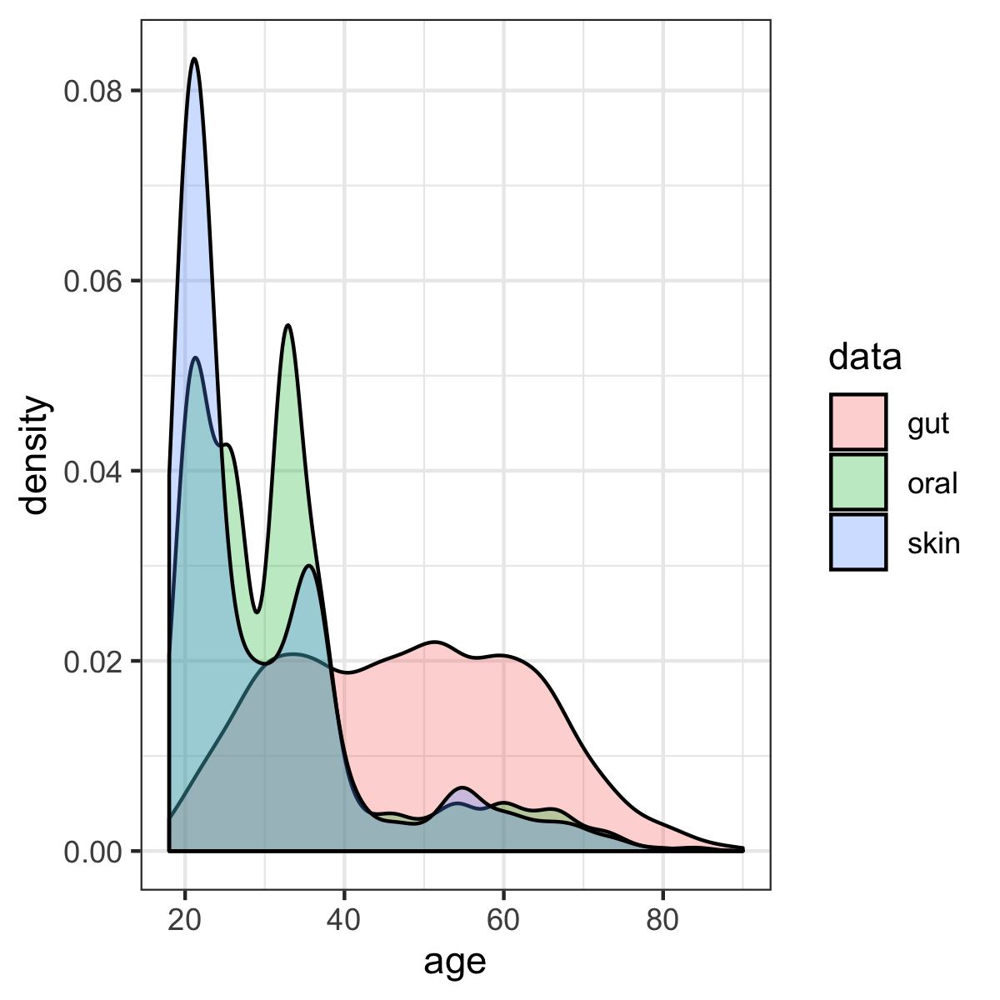

Human skin, oral, and gut microbiomes predict chronological age
-----------------------
This study performed Random Forest regression analyses of human microbiota from multiple body sites (gut, mouth and skin).
This repository provided all source data and codes for generation of all results in the manuscript. Furthermore, in output directories, we also provided additional exploratory analysis results for a better understanding of our microbiota-based models for age prediction.


## Data source
### Qiita study IDs involved in the meta-analysis: 
* Gut microbiota:

| QIITA Study ID | Project name | Publication(s) | # of samples involved |
| ------------------ | ------------------ |------------------ | ------------------ |
|[10317](https://qiita.ucsd.edu/study/description/10317)| American Gut Project | [American Gut: an Open Platform for Citizen Science Microbiome Research](https://msystems.asm.org/content/3/3/e00031-18) | 2770 |
|[11757](https://qiita.ucsd.edu/study/description/11757)| GGMP regional variation | [Regional variation greatly limits application of healthy gut microbiome reference ranges and disease models](https://www.nature.com/articles/s41591-018-0164-x)| 1609 |

* Oral microbiota:

| QIITA Study ID | Project name | Publication(s) | # of samples involved |
| ------------------ | ------------------ |------------------ | ------------------ |
|[10317](https://qiita.ucsd.edu/study/description/10317)| American Gut Project | [American Gut: an Open Platform for Citizen Science Microbiome Research](https://msystems.asm.org/content/3/3/e00031-18) | 547 |
|[1841](https://qiita.ucsd.edu/study/description/1841)| Flores_SMP | [Temporal variability is a personalized feature of the human microbiome](https://www.ncbi.nlm.nih.gov/pmc/articles/PMC4252997/) | 642 |
|[550](https://qiita.ucsd.edu/study/description/550)| Moving pictures of the human microbiome | [Moving pictures of the human microbiome](https://genomebiology.biomedcentral.com/articles/10.1186/gb-2011-12-5-r50)| 508 |
|[1774](https://qiita.ucsd.edu/study/description/1774)| Puerto Rico and Plantanal | NA| 48 |
|[2010](https://qiita.ucsd.edu/study/description/2010)| Longitudinal babies project |[Partial restoration of the microbiota of cesarean-born infants via vaginal microbial transfer](https://www.nature.com/articles/nm.4039)| 72 |
|[2024](https://qiita.ucsd.edu/study/description/2024)| TZ_probiotic_pregnancy_study |[Microbiota at Multiple Body Sites during Pregnancy in a Rural Tanzanian Population and Effects of Moringa-Supplemented Probiotic Yogurt](https://aem.asm.org/content/81/15/4965)| 254 |
|[2202](https://qiita.ucsd.edu/study/description/2202)| mit_daily_timeseries |[Host lifestyle affects human microbiota on daily timescales](https://genomebiology.biomedcentral.com/articles/10.1186/gb-2014-15-7-r89)| 285 |
|[10052](https://qiita.ucsd.edu/study/description/10052)| Yanomani 2008 |[The microbiome of uncontacted Amerindians](https://advances.sciencemag.org/content/1/3/e1500183)| 16 |
|[11052](https://qiita.ucsd.edu/study/description/11052)| Knight_ABTX | NA | 178 |

* Skin microbiota:

| QIITA Study ID | Project name | Publication(s) | # of samples involved |
| ------------------ | ------------------ |------------------ |------------------ |
|[10317](https://qiita.ucsd.edu/study/description/10317)| American Gut Project | [American Gut: an Open Platform for Citizen Science Microbiome Research](https://msystems.asm.org/content/3/3/e00031-18) | 440|
|[11052](https://qiita.ucsd.edu/study/description/11052)| Knight_ABTX | NA | 177|
|[2010](https://qiita.ucsd.edu/study/description/2010)| Longitudinal babies project |[Partial restoration of the microbiota of cesarean-born infants via vaginal microbial transfer](https://www.nature.com/articles/nm.4039)| 65|
|[1841](https://qiita.ucsd.edu/study/description/1841)| Flores_SMP | [Temporal variability is a personalized feature of the human microbiome](https://www.ncbi.nlm.nih.gov/pmc/articles/PMC4252997/) |1293 |

### The age distribution of all samples in gut, oral and skin datasets: 

Although the skewed age distribution in the skin or oral microbiota dataset may decrease the accuracy of age prediction for the older adults, it will not affect the conclusions about the relative ability of different human microbiomes to predict age.

## R scripts
There are some R scripts and files in this repository that were used in the process of preparing the manuscript, also. Here I'll try to explain some of these.

#### Usage requirements and dependencies
This meta-analysis depends on the self-developed R package [`crossRanger`](https://github.com/shihuang047/crossRanger) that can be downloaded as following.
``` r 
## install.packages('devtools') # if devtools not installed
devtools::install_github('shihuang047/crossRanger')
```
#### What analyses were done by the R script `Age.crossRF_reg.ranger.R`?
The R script `Age.crossRF_reg.ranger.R` performs the meta-analysis of microbiota data for predicting chronological age. For each dataset (i.e. gut, mouth or skin), this script can perform analyses as following. 
* Data trimming (such as sample filtering by NA values in the metadata). 
* RF modeling and performance evaluation for the whole dataset. 
* RF modeling and performance evaluation for the sub-datasets. To test if confounders (such as sex) affected the modeling, we first trained the age model within a sub-dataset stratified by a confounder, then applied it on all the other sub-datasets. For both model training and testing, we evaluated regression performance using mean absolute error (MAE). 
* Cross-application of RF models built on the sub-datasets and evaluated the performance using MAE.

All the anaylses can be conducted with this script typically in the [Rstudio](https://rstudio.com/products/rstudio/download/) or [R concole](https://www.r-project.org/).

#### What inputs are neccessary for this R script? 

| Input | gut_data |oral_data | skin_data | Description |
| ------------------ | ------------------ |------------------ |------------------ |-------------------------- |
| `datafile`  |  gut_data/gut_4434.biom | oral_data/oral_4014.biom | skin_data/skin_4168.biom | Biom-table file |
| `sample_metadata`  | gut_data/gut_4434_map.txt | oral_data/oral_2550_map.txt | skin_data/skin_1975_map.txt | Metadata file |
| `feature_metadata` |  gut_data/gut_taxonomy.txt | oral_data/oral_taxonomy.txt | skin_data/skin_taxonomy.txt | Feature metadata file |
| `prefix_name`  | gut_4434 | oral_2550 | skin_1975 | The prefix of datasets |
| `s_category`  |  c("cohort", "sex") | "qiita_host_sex" | c("body_site","qiita_host_sex") | The metadata category for dividing datasets |
| `c_category`  |  "age" | "qiita_host_age" | "qiita_host_age" | The targeted metadata category for RF modeling |


## About the `Input/` folder
This folder includes all the input files (biom table, sample metadata and feature metadata files) necessary for the RF regression analysis. 

## About the `Output/` folder
This folder contains all of the output files from the main R script `Age.crossRF_reg.ranger.R`.

## About the `Figures/` folder
This folder contains selected output figures from the `Output` folder to genenrate the formal figures in our manuscript.

## Acknowledgements

 This work is supported by IBM Research AI through the AI Horizons Network. For
 more information visit the [IBM AI Horizons Network website](https://www.research.ibm.com/artificial-intelligence/horizons-network/).
